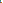

# LiG



froQ 的 LiG：**Less is Great**，用少量颜色做语法高亮。本仓库维护 canonical token spec 和展示网站。

基础色、语义角色及四个变体的唯一事实源是 [`core/spec.json`](core/spec.json)。网站从 core 派生；Neovim、VS Code 与轻量工具 port 从同一套 core 生成，用户可以下载生成产物。

## 开发

```bash
pnpm install --frozen-lockfile
pnpm dev
pnpm tokens:generate
pnpm tokens:test
pnpm tokens:typecheck
pnpm tokens:check
pnpm typecheck
pnpm lint
pnpm build
```

`pnpm palette:generate` 保留为 `tokens:generate` 的命令别名。

## Icon

透明九宫格像素 L：1 = struct.base，4 = ref.base，7 = mono.base，8 = action.base；7 是转角，其余五格透明。图标颜色直接从 core 的语义 token 生成，随 `pnpm tokens:generate` 更新，由 `tokens:check` 检查。

- 仓库 README / gallery：[SVG](public/brand/lig.svg)、[512px PNG](public/brand/lig.png)。SVG 根据系统明暗偏好切换颜色，PNG 固定使用 light 色值。
- 各主题固定版本：`public/brand/lig-{light,dark,light-paper,dark-paper}.{svg,png}`。
- Web：主题切换会更新 SVG favicon；提供 32px PNG fallback、180px Apple touch icon、192/512px manifest icon。图标不包含底色，也不提供离线缓存。
- GitHub 没有仓库独立头像设置；README 使用上述图标。社交预览图是单独的仓库设置。

## 目录

| 路径 | 说明 |
| --- | --- |
| `core/spec.json` | 唯一手工维护的基础色、语义引用、混色公式和变体定义 |
| `core/resolve.ts` | 无全局状态的纯 token 解析器 |
| `core/generated/tokens.json` | 可供不同语言、不同 port 消费的确定性 JSON |
| `core/README.md` | token 契约、命名、混色规则和变体决策 |
| `core/tests/` | 非 UI 的契约与回归检查 |
| `palette/src/` | 将 core 转为现有网站 palette API 的适配层 |
| `palette/generated/` | 现有网站格式的 JSON、CSS、SCSS 和 Tailwind 色板 |
| `app/components/palette/` | 色板与代码预览 UI |
| `app/pages/index.vue` | 首页 |
| `ports/` | TypeScript port 编译器、原生映射与契约检查 |
| `ports/lightweight/` | Ghostty、fzf、Zellij、tmux、Starship、bat、eza 适配及安装说明 |
| `dist/ports/` | 本地生成的分发文件（不提交） |
| `public/ports/` | 构建时生成的轻量 port 下载文件（不提交） |
| `vendor/ui/` | 以 subtree 嵌入的完整 `0froq/ui` 源码；通过 `file:vendor/ui` 编译 |

`core/generated/` 和 `palette/generated/` 的 token 产物提交到仓库，不能手工编辑；`tokens:check` 检查它们是否与 spec 一致，且不会写文件。port 分发文件在构建时生成，通过 `ports:check` 检查。

## 这一阶段的颜色决策

支持 `light`、`dark`、`light-paper`、`dark-paper` 四个变体。八种 accent、neutral 与 paper 灰阶及语义角色都在 core 中定义，计算不依赖调用顺序。`text.secondary` 与 `surface.status` 分开定义，避免把背景色用于次级文字；较弱的层级保留为 `text.subtle`。

paper 画布使用独立的暖灰阶，彩色变体使用按色相校准的 OKLCH 坐标，黄色单独校准。详见 [core 契约](core/README.md)。初始映射来自 `0froq/lig.nvim` 和 `0froq/vscode-theme-LiG`，之后这里是维护源，旧 port 是迁移输入。

`pnpm ports:generate` 生成两个编辑器 preview 分发包及七种轻量 port，各含四个变体。轻量文件集中在主仓库，通过网站下载与 CI 的 `lig-lightweight-ports` artifact 分发，无需独立仓库。`pnpm build` / `pnpm generate` 会先生成下载文件。安装说明见 [lightweight README](ports/lightweight/README.md)。本机配置不会被生成器修改，编辑器 preview 仓库仍独立发布。

## 手动验收

站点已接入 `@froq/ui`，Ports 的 agent 指令使用库里的 `CopyButton` 和 `Collapsible`。作用域 `.lig-ui.ui` 将库的十二个主题变量映射到本站的颜色、字体和动效变量；已有页面组件仍保留本地实现。上游同步和抽组件流程见根目录 `AGENTS.md`。库源码随本仓库提交，远端构建不依赖开发机路径。

agent 指令随当前语言和主题生成，包含当前站点的下载来源。指令要求先只读检测已安装技术栈并列出可用 port、变体和配置方案，等待用户确认后再备份、合并配置并验证。本网站不会执行本机扫描或安装。

没有运行 UI 测试或浏览器检查。需要手动验收：agent 指令复制成功／拒绝状态、语言与主题切换后的指令内容、终端窄屏换行和彩字／彩底、四个主题切换后的下载文件名、旧 `/lab` 链接跳转、各工具的选中状态与边框、浅色背景黄色文字、tmux 内嵌颜色和 bat 语法高亮。原生配置解析检查不代表视觉验收。

## 许可

手写字体见 `app/kit/hand-font.ts`（SIL OFL 1.1）。
