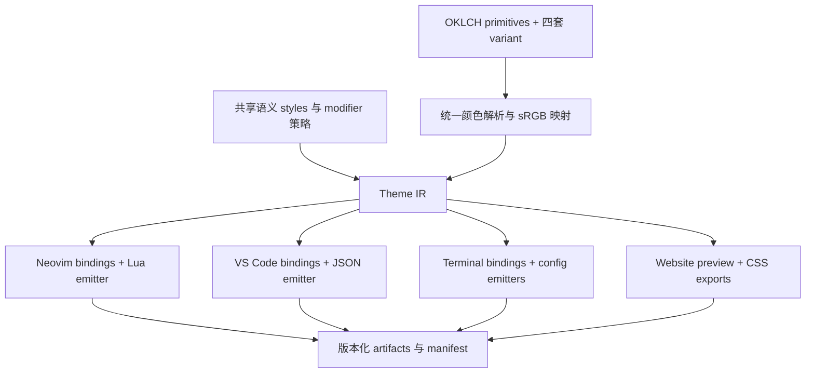

# LiG：统一 tokens 与多 port 生成架构

日期：2026-10-04。状态：设计建议，尚未实施。

## 1. 建议采用的方案

**在 `0froq/lig` 中维护设计源、共享高亮规则与 TypeScript 生成器，生成各工具原生的主题文件。`lig.nvim` 和 `vscode-theme-LiG` 保留现有安装身份，成为发行仓库。**

最常见的配色调整应当只修改 tokens；新增语法角色、插件适配或编辑器能力时，维护对应规则。单一事实源包含颜色和使用颜色的语义约定，不能只包含十几个原色。

我建议统一三件事：

1. 颜色计算：OKLCH 定义、variant 参数、语义别名、色域处理与导出精度。
2. 高亮意图：什么属于 `mono / struct / ref / action`，什么场合使用 highlight、base、muted，以及独立的字体样式。
3. 生成工程：所有 port 使用 TypeScript 编写 adapter、共用构建入口和可追溯的产物清单。

保留各宿主自己的解析和运行机制：Neovim 使用 Tree-sitter/LSP 和 Lua 加载器；VS Code 使用 TextMate/semantic tokens 和 JSON 主题。相同输入角色应得到相同设计样式，但主题本身无法保证两个编辑器把所有代码识别成完全相同的角色。

## 2. 本次检查的范围与证据

| 对象             | 本次读取位置 / 基线                                                              | 说明                                                                                    |
| ---------------- | -------------------------------------------------------------------------------- | --------------------------------------------------------------------------------------- |
| LiG 当前工作目录 | `/Users/oQ/code/vis/lig`，HEAD `945a4c3e540f5fa8d18fcb516d817283f5f1401e`        | 已包含大量未提交修改；以下判断以工作目录实际内容为准，不能用 HEAD 重建这次状态          |
| lig.nvim         | `/Users/oQ/code/0froq/lig.nvim`，HEAD `7bb6ca25705baedaae22996eca17c3a8a1745bb2` | 本地 demo 文件有未提交改动；未修改该仓库                                                |
| VS Code LiG      | 远端 `main`，`f19d61ae98c8de2d94d753cf582e7aa4753f0b58`                          | 只读检查副本：`/tmp/lig-port-review-vscode-20261004`；不是 Marketplace 已安装版本的验证 |

读取了颜色源、派生公式、语法映射、UI 映射、运行时配置、构建与发布脚本，并核对编辑器官方文档。运行了当前 LiG 的 `pnpm tokens:check`，结果通过：core 和网站产物匹配当前 spec。本轮没有进行编辑器 UI 测试，也没有修改生成器、主题或发布配置。

### 2.1 当前 LiG core

目前已经有合理的颜色基础：

- `core/spec.json`：8 个彩色原语、13 个灰度原语，OKLCH 定义；共享 tokens、light/dark mode 和四个 variant。
- `core/resolve.ts`：引用解析、循环检查、mode 与 variant 覆盖；先计算浮点坐标，再导出 HEX。
- `core/color.ts`：统一颜色转换与固定 L/H、缩减 C 的 sRGB 映射；提供对比度计算。
- `core/syntax.ts`：Neovim capture 名到语义颜色 token 的映射。
- 当前每个 variant 有 106 个已解析语义颜色 token。

现有 `palette/src/nvim-build.ts` 是**网站旧 palette API 的兼容 adapter**，并没有生成可安装的 Neovim 主题。当前生成入口输出 core JSON 和网站 JSON/CSS/SCSS/Tailwind 数据，尚未输出两个编辑器 port。

两处需要处理：

- `core/syntax.ts` 目前把 Neovim capture 词汇放在 core。以后这张表应移入 Neovim adapter；公共层保留编辑器无关的角色。
- 网站实验区的 L/C/background 是每个 variant 独立的预览状态，不会写回 spec。未来要明确“实验值”与“发行值”，避免 demo 显示一套、下载另一套。

当前 `dark` 与 `dark-soft` 的全部解析 token 相同。保留四个稳定身份，但不要在报告或下载页声称它们已经有不同的设计；后续校准是独立设计工作。

证据：[core resolver](/Users/oQ/code/vis/lig/core/resolve.ts:8)、[当前 spec](/Users/oQ/code/vis/lig/core/spec.json)、[网站兼容 adapter](/Users/oQ/code/vis/lig/palette/src/nvim-build.ts:1)、[实验状态](/Users/oQ/code/vis/lig/app/components/palette/PaletteSyntax.vue:35)。

### 2.2 lig.nvim

现有管线是：

```text
colors/source.lua
  → template.lua：三变体、背景/前景、UI、诊断、terminal、syntax
  → groups/*.lua：基础组、Tree-sitter、LSP、插件
  → theme.lua：nvim_set_hl + terminal_color_0…15
```

值得保留的是角色分层、Tree-sitter/LSP 的声明与引用区分，以及 Lua 运行时的 `setup`、透明背景、插件选择、用户 override 等能力。`extras` 已能生成 Ghostty、Kitty、WezTerm、Vim，说明 port 扩展无需从零设计。

需要替换的是独立 HEX 源与 RGB blend 公式。`Util.bg / Util.fg` 是可变的模块状态，而 `get_palette()` 在本次 `apply_ui()` 更新它们之前生成三变体；从调用顺序看，重复加载不同主题存在依赖上次状态的风险。本轮未执行运行时复现，按结构风险记录。新 compiler 必须使用显式输入的纯函数。

另有接口一致性问题：`template.lua` 的 flat syntax tokens、`groups/base.lua` 和 `groups/treesitter.lua` 是不同的赋色路径。Tree-sitter 直接取 family 数组，未统一通过 flat syntax tokens，所以不能认为 `mono.enabled` 已经一致影响所有高亮组。迁移时要审计实际行为，不能只搬配置字段。

证据：[配色管线](/Users/oQ/code/0froq/lig.nvim/lua/lig/colors/template.lua:268)、[可变 blend 输入](/Users/oQ/code/0froq/lig.nvim/lua/lig/util.lua:4)、[Tree-sitter 规则](/Users/oQ/code/0froq/lig.nvim/lua/lig/groups/treesitter.lua:10)、[运行时选项](/Users/oQ/code/0froq/lig.nvim/lua/lig/config.lua:9)。

### 2.3 VS Code LiG

现有管线是 TypeScript：

```text
scripts/colors.ts：HEX primitives
  → template.ts：RGB blend、dark/light pair、语义角色
  → helper.ts：mode/soft 选择
  → theme.ts：Workbench、semanticTokenColors、TextMate
  → themes/lig-{variant}.json
```

每套现有 JSON 含 191 个 Workbench color key、86 个 semantic selector、15 条 TextMate rule；这 15 条 rule 覆盖 62 个 scope selector。不是只有十几条语法规则。

角色意图与 lig.nvim 接近，但计算是另一个实现；light/dark 用数组位置、soft 用 `softXxx || xxx` 选择，容易隐式回退。`theme.ts` 还把 Monaco 的 `base / rules` 一起塞进 VS Code 输出，其中 `rules` 只搬了前景、没有完整字体样式。建议 VS Code 与 Monaco 分为不同 emitter，避免混用两个宿主的数据模型。

当前 extension 是声明式主题，`publisher: froQ`、`name: theme-lig`，版本 `0.1.3`；`engines.vscode` 是 `^1.107.0`。四个主题名称和路径已有安装兼容价值，迁移时保留。现有 tag workflow 会发布 Marketplace/Open VSX，但本轮没有验证发布结果。

证据：[颜色源](https://github.com/0froq/vscode-theme-LiG/blob/f19d61ae98c8de2d94d753cf582e7aa4753f0b58/scripts/colors.ts)、[配色模板](https://github.com/0froq/vscode-theme-LiG/blob/f19d61ae98c8de2d94d753cf582e7aa4753f0b58/scripts/template.ts)、[高亮与 UI 规则](https://github.com/0froq/vscode-theme-LiG/blob/f19d61ae98c8de2d94d753cf582e7aa4753f0b58/scripts/theme.ts)、[extension manifest](https://github.com/0froq/vscode-theme-LiG/blob/f19d61ae98c8de2d94d753cf582e7aa4753f0b58/package.json)。

## 3. 统一的边界：共享设计，适配识别结果

VS Code 的 TextMate scopes 和 semantic tokens 是两条输入路径，后者可以覆盖前者。Neovim 的 Tree-sitter capture 和 LSP highlight 也是不同层；LSP type、modifier、typemod 各有优先级。因此不能把 Neovim capture 名换成 TextMate scope 名，就认为完成了等价映射。[VS Code 高亮机制](https://code.visualstudio.com/api/language-extensions/syntax-highlight-guide)、[Neovim semantic highlight](https://raw.githubusercontent.com/neovim/neovim/v0.12.4/runtime/doc/lsp.txt)。

按以下层级承诺一致性：

| 层级     | 一致性目标                             | 不能保证的部分                               |
| -------- | -------------------------------------- | -------------------------------------------- |
| 颜色     | 同 variant、同 token 导出相同 sRGB HEX | 显示器、字体、宿主抗锯齿和透明背景效果       |
| 语义角色 | 同角色使用同 family/tier/style         | 两个 parser 是否识别出同角色                 |
| 重叠规则 | 已支持场景遵守共同意图                 | 未知语言扩展、自定义 modifier、用户 override |
| UI       | 编辑区、选区、诊断等共享视觉意图       | 不同编辑器的控件结构和叠色机制               |

现有四类建议保留，作为**视觉 family**。`struct` 表达参数绑定、模块、标签等结构性信息，不等于 LSP 的 `struct` token type；后者是类型，应归入 `ref`。`ref` 包含类型、常量、值与 escape，并非所有“引用表达式”都必须变蓝。

不要让 family 名同时承担语法类别、宿主 selector 和颜色值三个职责。

## 4. 推荐的数据模型

设计源分成颜色 tokens、语义 styles、port bindings 三层；compiler 输出一个已解析、可追踪的 Theme IR。



### 4.1 颜色 tokens

继续采用当前 OKLCH 体系，不为接入两个 port 重写颜色算法。

- primitive：8 个彩色 H anchor 与灰度阶梯。
- variant：独立的 L/C 参数、彩色 tier 差值、灰度选择和 surface 角色。
- semantic color：`text.*`、`surface.*`、`family.*`、`syntax.*`、`diagnostic.*`、`git.*`、`terminal.*`。

四套 variant 分文件维护，输出也分别完整展开。可以共用 recipes 和 hue anchors，但不建议继续把浅色参数写成“dark L 减去 .19”：直接写浅色自己的 L/C，避免调整深色顺带改变浅色。共享的是生成逻辑，四套参数仍能独立设计。

例如，未来 light 配置可以表达为：

```json
{
  "id": "light",
  "polarity": "light",
  "accentBase": { "l": 0.55, "c": 0.09 },
  "accentTiers": {
    "highlight": { "deltaL": -0.07, "deltaC": 0 },
    "muted": { "deltaL": 0.07, "deltaC": 0 }
  },
  "mono": {
    "highlight": "soft_800",
    "base": "soft_600",
    "muted": "soft_400"
  },
  "canvas": "white"
}
```

这是建议的 authoring 结构，数值沿用当前 light，没有新增校准。`mono.secondary` 等已有角色仍保留；“四个 family”不要求每个 family 永远只能有三个 token。

所有 adapter 只取最终 token，不做 brighten/blend/gamut conversion。若编辑器需要新的 UI 混色，先将其定义为共享 semantic token 或有说明的 port token，再由公共 resolver 计算。

### 4.2 语义 styles

Color token 回答“什么颜色”，style 回答“什么样式”，两者分开。一个角色可以只有 italic，没有前景；这对 semantic modifier 很重要。

以下是接口示意，尚不是已实现 API：

```ts
interface TextStyle {
  foreground?: ColorTokenId
  background?: ColorTokenId | 'clear'
  bold?: boolean
  italic?: boolean
  underline?: boolean
  strikethrough?: boolean
}

interface SemanticStyleRule {
  id: StyleId
  extends?: StyleId
  style: TextStyle
}
```

例如 `symbol.variable` 使用 `syntax.variable`，`keyword.neutral` 使用 `syntax.keyword`；`modifier.defaultLibrary` 只提供 italic。`undefined` 表示继承/不指定，`false` 表示显式关闭，`clear` 表示清除背景，三者不能混用。

共享 TextStyle 只放共同能力。Neovim 的 `sp / undercurl / reverse / nocombine` 放在 adapter 能力扩展中，不把 Lua highlight 完整结构塞进公共模型。`link` 也属于 Neovim 的输出机制，而非通用 style 继承。

### 4.3 Theme IR 与追踪

一个 variant 的 IR 包括：

- 已解析 colors 与 styles。
- authored OKLCH、mapped OKLCH、最终 HEX。
- token 引用链、style 继承链。
- semantic modifier 决策与默认 profile。
- 版本信息、warnings、支持能力。

特别要区分 authored 与 mapped：当前 `.oklch` 保存解析后的设计坐标，HEX 才经过色域映射。后续 inspector 若只显示设计 C，却显示映射后的 HEX，会让用户误以为导出色仍具有相同 C。建议显式显示 `authored → mapped → hex`。

映射 policy 固定为当前 `srgb-constant-lh-chroma-reduce`，导出一次量化为小写 `#rrggbb`。网站默认也用这些 HEX 做 port 对照；广色域预览若以后提供，应明确是另外一个目标色域。

### 4.4 Bindings

bindings 只维护宿主 vocabulary 到 StyleId/ColorTokenId 的映射，不保存颜色字面量。

```ts
// 接口示意；多个宿主 selector 绑定同一个设计角色。
const binding = {
  style: 'type.reference',
  neovim: ['@type', '@type.builtin'],
  vscodeSemantic: ['type', 'class', 'interface', 'struct', 'typeParameter'],
  vscodeTextmate: ['entity.name.type', 'support.type']
}
```

实现中分别放进各 adapter 的文件，避免公共设计文件积累所有平台 key。公共层定义 `type.reference`；Neovim 和 VS Code 各自登记哪些 selector 能近似表达它。

任何例外都记录 reason、适用语言/版本和回归 fixture。禁止“某 port 直接写一个 HEX 修好”成为常规做法。

## 5. 建议统一的语法策略

### 5.1 以当前 core 为设计基线，登记旧 port 差异

当前 core 是这轮已校准的设计源；旧 port 用于补全规则覆盖与保留行为，不反过来覆盖新配色。迁移时分别审查“颜色改变”和“类别改变”。

| 角色                      | lig.nvim 当前主要处理                                                                                     | VS Code 当前处理                                                               | 新共享策略建议                                                                                              |
| ------------------------- | --------------------------------------------------------------------------------------------------------- | ------------------------------------------------------------------------------ | ----------------------------------------------------------------------------------------------------------- |
| 普通 variable             | Tree-sitter `mono[1]`；经典 `Identifier` 仍是 `mono[2]`                                                   | TextMate/semantic 普通 variable 都是 mono base                                 | `mono.highlight`；保持和 keyword 的灰度区别                                                                 |
| 普通 keyword              | mono base                                                                                                 | mono base，但 import/export 等 TextMate scope 是 struct                        | 普通控制/声明关键字 mono base；modifier/directive struct；有明确 action 的 return/async/exception 用 action |
| property/member           | mono base                                                                                                 | mono base                                                                      | 保持 mono base                                                                                              |
| 参数绑定                  | Tree-sitter parameter 是 struct；LSP parameter 默认链接 variable，declaration/definition 才链接 parameter | semantic parameter 默认 mono；声明/定义才 struct；TextMate parameter 是 struct | 参数绑定 struct base；只能识别为“参数引用”的 semantic token 用 variable 层级；有语言依据才识别绑定          |
| 类型引用                  | ref muted                                                                                                 | ref muted                                                                      | 保持 ref muted                                                                                              |
| 类型声明/定义             | ref highlight                                                                                             | ref highlight                                                                  | 保持 ref highlight                                                                                          |
| 函数定义 / 调用           | action highlight / base                                                                                   | semantic 有声明区分；TextMate `entity.name.function` 通常 base                 | 有明确声明信息用 highlight；无法区分时 action base                                                          |
| 常量 / 数字 / boolean     | ref base                                                                                                  | ref base                                                                       | 保持；readonly symbol 是否升级常量需独立规则                                                                |
| builtin variable / escape | ref highlight                                                                                             | ref highlight，另有自定义 Python selectors                                     | 保持，扩展规则单独登记                                                                                      |
| 字符串 / operator         | mono muted                                                                                                | mono muted                                                                     | 当前 core 已改为 mono secondary，作为显式设计差异保留                                                       |
| 注释 / 标点               | mono muted                                                                                                | mono muted                                                                     | 保持，与 string 分层                                                                                        |
| constructor               | Tree-sitter mono base                                                                                     | 取决于 grammar/LSP 分类，不能笼统认为是 function                               | 当前 core 的 action base 保留；宿主无法识别时记录 fallback                                                  |

这张表是迁移决策，不是宣称 parser 已完全等价。比如 VS Code 并没有一个所有语言都通用的标准 `constructor` semantic type；Neovim 的 `@constructor` 也可能被 grammar 用于不同语言结构。不能仅凭名字把其所有出现都解释为同一种操作。

建议同时给四个 family 加清晰的文档定义和每个 role 的例子，减少以后靠名称猜颜色。`type.definition` 与 `type.reference`、`function.declaration` 与 `function.call` 必须是不同角色，不能只留笼统的 Type/Call。

### 5.2 Modifier 使用受控的策略

当前 Neovim 将全局 `static / async / modification` 链接到 keyword 的颜色组；从规则看，它们可能改变被标记 symbol 的 family。建议收敛：

| Modifier                 | 建议行为                                                            |
| ------------------------ | ------------------------------------------------------------------- |
| declaration / definition | 根据 symbol type 选择对应绑定或定义角色；不是所有声明都加同一种颜色 |
| defaultLibrary           | 默认 italic；若有独立 builtin 角色，再由该角色决定颜色              |
| deprecated               | strikethrough，保留 symbol 原有前景                                 |
| readonly                 | 对确有常量语义的变量/属性映射 ref；不能无条件把只读参数等同数字常量 |
| static                   | 默认不重着色；文字 `static` 自身仍由 keyword.modifier 处理          |
| async                    | 函数继续属于 action；关键字 `async/await` 由 keyword.action 处理    |
| modification             | 默认不改变 variable/property family；写入状态若需要表现，再独立设计 |
| documentation            | 按实际 token type 处理，不能把文档中的任意 symbol 统一当注释        |

这是有意调整旧规则的建议，迁移报告中要单列。尤其参数引用保留 variable 层级后，会比旧 VS Code 的 mono base 更强，这是统一变量层级带来的变化。

不能把一条通用 `*.declaration` 直接映射成绿色；它会使类型定义、函数定义失去自己的 family。编译器应从公共策略生成 type-specific 规则。

VS Code selector 可以包含 type、多个 modifiers 和 language，支持前景及字体样式；semantic 前景不支持透明度。主题显式输出 `semanticHighlighting: true`，仍尊重用户与语言扩展的启用设置。[VS Code Semantic Highlight Guide](https://code.visualstudio.com/api/language-extensions/semantic-highlight-guide)。

### 5.3 不复制一套“万能优先级”

公共层规定角色选择和样式组合的意图，adapter 按宿主机制实现。Neovim LSP type/mod/typemod 是叠加 highlight，VS Code 使用 selector 的匹配机制；两者不能靠同一个 priority 数字对应。

做法是：

1. 同一个角色的颜色与样式从共同 definition 取值。
2. declaration、readonly、defaultLibrary、deprecated 的已支持组合建立明确预期。
3. adapter 生成必要的特定 selector/typemod 规则；不枚举所有 modifiers 的笛卡尔积。
4. 核查这些组合在真实宿主规则解析中的结果，避免斜体规则意外丢失前景或定义层级。

例如 `function.declaration.defaultLibrary` 应保持 action highlight 并叠加 italic；`variable.deprecated` 保留 mono highlight 并叠加删除线。若语言提供者未发送相应 modifier，主题无法补出该信息。

## 6. Neovim adapter 的设计

### 6.1 生成内容

TypeScript emitter 生成 Lua 数据：

- 四套最终 token 值、直接别名关系与生成元信息。
- 共同语义 style 的 token 引用。
- 经典 syntax、Tree-sitter、LSP 的 bindings。
- 基础 UI 与每个已支持插件的 highlight 定义。
- terminal 16 槽位数据、lualine/lightline 对接数据。

Lua runtime 保留少量手写代码：选择 style、响应 `vim.o.background`、插件发现、应用选项与用户 hooks、调用 `nvim_set_hl`。**它只解析引用和应用配置，不再维护颜色派生公式，也不依赖用户安装 Node。**

输出目录示意：

```text
lig.nvim/
  colors/lig.lua                         # 保留入口
  colors/lig-{variant}.lua
  lua/lig/init.lua                       # 原生 runtime
  lua/lig/config.lua
  lua/lig/runtime.lua
  lua/lig/generated/tokens/{variant}.lua
  lua/lig/generated/styles.lua
  lua/lig/generated/groups/base.lua
  lua/lig/generated/groups/treesitter.lua
  lua/lig/generated/groups/semantic_tokens.lua
  lua/lig/generated/groups/plugins/*.lua
  lua/lualine/themes/...
  doc/lig.nvim.txt
  lig-build.json
```

加载时选出当前 variant 的 token table，按启用插件取相应规则，把 token reference 解析成 HEX 后应用。不要预先把所有组的颜色完全写死，否则用户 hooks 和语义别名会变得难以维护。

### 6.2 配置的兼容边界

| 现有能力                                  | 建议                                                                                  |
| ----------------------------------------- | ------------------------------------------------------------------------------------- |
| style / background 切换                   | 保留四套身份、现有 colorscheme 名称与切换习惯                                         |
| transparent                               | runtime 对明确列出的 surface 组清除背景；不做全局删除所有 bg                          |
| terminal_colors                           | 保留开关；值来自公共 terminal tokens                                                  |
| plugins.all / auto / 显式选择             | 保留；manifest 登记插件名称、组文件和支持版本线索                                     |
| styles.comments / keywords / functions 等 | 作为用户样式 overlay；统一影响对应 classic/Tree-sitter/LSP 角色，明确哪些支持         |
| on_colors                                 | 保留过渡兼容 facade，映射旧颜色名称到 canonical token override；支持范围要有 fixture  |
| on_highlights                             | 保留最后的原生 escape hatch；属于用户定制，不承诺跨 port 一致                         |
| mono.enabled / keep                       | 用共享 profile 生成角色替换；各高亮输入路径应一致生效                                 |
| day_brightness                            | 先审计实际调用；不把旧 HSLuv 参数重新带入 OKLCH compiler；若移除需弃用说明            |
| cache                                     | 先保留兼容接口；只有测得收益才引入复杂缓存，key 必须包含产物 hash、有效选项与插件集合 |

用户配置可以覆盖最终语义 tokens。直接 alias 的覆盖可以沿 alias 关系传播；**已编译的 mix/offset 派生值不会因为用户改了一个 HEX primitive 就自动重算 OKLCH**。颜色再校准应回到主仓库生成。override API 必须明确这条界限，不能表现为半套颜色计算器。

推荐加载顺序：

```text
选择 variant → 深拷贝 tokens → 用户 token / legacy on_colors overlay
→ 解析直接 aliases → 选择 profile 与插件 → 解析 style 引用
→ 用户 styles / transparent 等 overlay → on_highlights → nvim_set_hl
```

旧回调可能任意修改嵌套数组，兼容层不能承诺所有修改自动无损映射。要定义可支持字段、冲突顺序和迁移提示；对于无法转换的定制仍允许 `on_highlights`。

Neovim 的 `link` 与其他属性一起设置时只有 link 生效。因此“链接某组，再增加 italic”必须先展开被链接样式或另用叠加组，不能输出 `{ link, italic }` 并期待组合生效。[Neovim highlight API](https://raw.githubusercontent.com/neovim/neovim/v0.12.4/runtime/doc/api.txt)。

## 7. VS Code adapter 的设计

一次生成三个部分：

1. `colors`：Workbench/UI ColorTokenId 绑定。
2. `tokenColors`：TextMate scope → StyleId。
3. `semanticTokenColors`：标准与已支持扩展 selector → StyleId / modifier 样式。

四套主题生成四份完整 JSON。保留 `froQ.theme-lig` extension 身份、现有名称、`uiTheme: vs / vs-dark` 和安装路径；不为共享设计增加可执行 extension host。通过 `contributes.themes` 注册即可。[VS Code 主题贡献点](https://code.visualstudio.com/api/references/contribution-points#contributes.themes)。

建议输出：

```text
vscode-theme-LiG/
  package.json
  themes/lig-dark.json
  themes/lig-light.json
  themes/lig-dark-soft.json
  themes/lig-light-soft.json
  README.md
  LICENSE.md
  lig-build.json
```

具体改进：

- Workbench 191 个现有 key 先逐项保留或明确删除，不只照顾 editor background。
- TextMate scope 数组可以按同 style 合并，但 parent scope 与语言限定 selector 不可随意排序或抹掉。
- generic keyword 保持 mono；import/export 等旧 struct 规则需与 Neovim 对齐后明确调整。
- Python `magicFunction / selfParameter / clsParameter` 等扩展 selector 单独存放，标注来源。自定义 selector 的出现取决于语言扩展，主题不会制造 semantic tokens。
- VS Code 的 semantic 样式属性与 TextMate 的 `fontStyle` 分别序列化，保留未指定和显式 false 的差别。
- 不把 Monaco 的 `base / rules` 混入 VS Code JSON；以后 Monaco 是单独 adapter，不能直接宣称等价支持 TextMate scopes。

另外核对了 VS Code 1.107.0 的实现：semantic style 支持 `strikethrough`，但不支持 token background；`fontStyle` 一旦给出，会把未列出的字体样式显式清除。因而 `defaultLibrary` 这类局部 overlay 优先生成 `{ italic: true }`，不直接生成 `fontStyle: 'italic'`；后者可能清掉另一条规则的 underline/bold。TextMate 的字体样式串需要由 adapter 合并并做 fixture 校验。公共模型有 background 字段不代表每条 syntax 路径都能输出它，不支持时必须报错或有声明的降级。[VS Code 1.107.0 token style 实现](https://github.com/microsoft/vscode/blob/1.107.0/src/vs/platform/theme/common/tokenClassificationRegistry.ts#L97)。

当前 `engines.vscode: ^1.107.0` 是兼容基线。新增 UI key 要记录最低支持版本；不能只在最新 VS Code 上校验后宣称支持整个既有范围。Neovim 的最低支持版本需另做 API 清单审计；demo 的 Neovim 0.12.4 parser pin 不等于主题最低运行版本。

## 8. UI 与 terminal tokens

### 8.1 UI：采用共享角色与有限宿主扩展

优先统一编辑器核心的视觉语义：

| 共享意图          | Neovim 代表组                     | VS Code 代表 key                               |
| ----------------- | --------------------------------- | ---------------------------------------------- |
| 编辑区文字 / 背景 | Normal                            | editor.foreground / editor.background          |
| 当前行背景        | CursorLine                        | editor.lineHighlightBackground                 |
| 普通 / 当前行号   | LineNr / CursorLineNr             | editorLineNumber.foreground / activeForeground |
| 选区背景          | Visual                            | editor.selectionBackground                     |
| 浮层文字 / 背景   | NormalFloat                       | editorHoverWidget.foreground / background      |
| 边界              | FloatBorder / WinSeparator        | widget 边框、panel 等各自 key                  |
| 诊断              | DiagnosticError/Warn/Info/Hint 等 | editorError/Warning/Info 等对应 key            |
| Git 增删改        | diff/gitsigns 组                  | diffEditor、gitDecoration 等 key               |

这是角色对应表，实际 qualifier 和复合 UI 会有多对多映射。正文 foreground 与 search/selected foreground 必须按实际背景成对设计，不把一个 contrast ratio 用在所有 surface 上。

共享层先补齐现有规则需要的角色，例如 `editor.lineNumber.active`、`surface.search.match`、`diagnostic.error.background`。确实只属于某平台的角色放在 `ports.nvim.* / ports.vscode.*` 的 token namespace，仍只能引用公共颜色和 recipes。不要把所有 Workbench key 都升格为全局公共 token。

透明度区分为“颜色插值”和“宿主 alpha 合成”。已有 OKLab mix 不能被当成 alpha blend。VS Code 若需要保持透出内容的选区 alpha，应单独写 alpha 绑定；Neovim 用已计算的实色近似，并登记能力差异。[VS Code Theme Color reference](https://code.visualstudio.com/api/references/theme-color)。

### 8.2 Terminal：明确 16 槽位契约

增加 `terminal.ansi.0…15`、foreground/background/cursor/selection tokens。Neovim 内置 terminal、VS Code terminal、Ghostty/Kitty/WezTerm 共用此契约；每个 emitter 只改文件语法。

旧 lig.nvim 的彩色 bright 槽使用 triad[3]，深色下对应 faded，不能简单理解为更亮。建议给 normal/bright 独立语义绑定，并在每个 mode 明确选择；不要根据三元数组索引暗示 ANSI 语义。ANSI bright 是槽位名称，不要求浅色背景下更接近白色，重点是可见与可分辨。

8 个彩色 primitives 比 ANSI 的 6 个彩色族多；orange、azure 不必硬塞进 16 槽位，可以用于语法、UI 和 extended palette。Base16 是导出契约之一，不能表达全部 `syntax / UI / modifier` 规则。

第一批终端 port 建议保留已有 Ghostty/Kitty/WezTerm 文件名和下载入口。Vim 涉及独立 highlight vocabulary，按独立 adapter 迁移；不要当成一个 terminal 文件模板。

## 9. 仓库与技术栈

### 9.1 推荐主仓库结构

```text
lig/
  design/                                 # 人维护的设计源
    primitives.json                       # hue anchors、灰度
    variants/
      dark.json
      light.json
      dark-soft.json
      light-soft.json
    colors.json                           # shared semantic aliases / recipes
    semantics/
      styles.json                         # editor-independent role styles
      modifiers.json
      profiles.json                       # standard / mono 等
    schema/
      design.schema.json

  packages/
    core/                                 # @lig/core，纯 TS、无文件 I/O
      src/
        color.ts
        tokens.ts
        styles.ts
        types.ts
        provenance.ts
        index.ts
      tests/
    compiler/                             # @lig/compiler，Node 构建程序
      src/
        load.ts
        validate.ts
        compile.ts
        artifacts.ts
        cli.ts
        ports/
          neovim/
            bindings/{base,treesitter,lsp}.ts
            integrations/*.ts
            emit.ts
          vscode/
            bindings/{workbench,textmate,semantic}.ts
            languages/{typescript,python}.ts
            emit.ts
          terminals/
            {ghostty,kitty,wezterm}.ts
          web/
            {css,json,scss,tailwind}.ts
      tests/

  ports/
    neovim/runtime/                       # 手写 Lua runtime 与安装入口
    neovim/metadata.json
    vscode/package.base.json              # 身份、兼容范围、发行元数据
    licenses/                             # 保留迁入代码的原有许可/署名

  apps/
    site/                                 # 当前 Nuxt 站点，消费 core / artifacts
      app/
      ...
  fixtures/
    source/                               # 同一批真实 TS、Python 等样例
    treesitter/                           # query/parser pins + 导出快照
    textmate/                             # grammar pins + scopes 快照
    semantic/                             # token-provider fixtures 与来源
  scripts/
    release.ts
    sync-distribution.ts
  docs/
    design.md
    ports.md
    compatibility.md
    decisions/
  generated/                              # 小型参考产物，禁止手改
    tokens/{variant}.json
    styles/{variant}.json
    coverage.json
  dist/                                   # 构建目录，不作为设计源
    neovim/
    vscode/
    terminals/
    web/
    manifest.json
  pnpm-workspace.yaml
  package.json
  pnpm-lock.yaml
```

这是目标结构。迁移第一步可以先在现有目录添加 compiler/ports，不必立刻搬动 Nuxt 和所有 imports；待首批两个 port 生成结果可审核后，再整理 workspace。

只先建 core、compiler、site 三个 workspace package。adapter 暂时是 compiler 内部模块，避免每新增一个小 port 都新增 npm package 和发布流程。如果以后某 adapter 有独立消费者或维护者，再拆 package。

### 9.2 工具选型

| 内容              | 选择                                         | 理由                                               |
| ----------------- | -------------------------------------------- | -------------------------------------------------- |
| 颜色、语义计算    | TypeScript                                   | 复用当前 core；Node 与网站共同使用                 |
| 设计 authoring    | JSON + JSON Schema                           | 可审查的纯数据，编辑器校验，避免在数据中写任意代码 |
| adapter authoring | TypeScript + typed binding tables            | 可类型检查、拆文件、生成 native 格式               |
| 包组织            | pnpm workspace、`workspace:*`、命名 catalogs | 沿用项目和 oq 约定                                 |
| 编译入口          | 当前 jiti，固定 Node/pnpm 版本               | 先复用；不同时保留 Lua/tsx/jiti 三套生成管线       |
| 校验              | TS strict、现有 ESLint、Node test            | 保留已有效的 node:test，避免为了换工具重写测试     |
| 网站              | 当前 Nuxt/Vue                                | 作为 consumer，不能成为主题构建的必需依赖          |
| 序列化            | 各 emitter 的小型确定性 serializer           | Lua table、JSON、conf/TOML 各自有原生表达需求      |
| npm SDK bundling  | 有独立 SDK 发布需求后用 tsdown               | 当前无需为主题产物引入额外 bundler                 |

暂时不引入 Turbo、插件发现框架或远程 registry。三个 workspace 的构建图足够明确，pnpm 和一个 compiler CLI 就能覆盖。Style Dictionary 可以生成一般 token 格式，但这次最难的是编辑器 selector 与 native runtime；先接入它并不能消除这些 adapter。建议先复用现有 core，后续确有标准交换需求再评估。

DTCG 可作为未来 token 导入/导出格式；当前 LiG 有 mix、offset、ramp 等自定义表达式，不应直接把它宣称为标准 DTCG 数据。标准桥接与主题编译分别维护，不为格式合规牺牲可读的设计参数。[Design Tokens Format Module](https://www.designtokens.org/tr/2025.10/format/)。

### 9.3 Port 接口保持很小

```ts
interface Artifact {
  path: string
  content: string | Uint8Array
}

interface PortAdapter {
  id: string
  supportedVariants: readonly VariantId[]
  requiredTokens: readonly ColorTokenId[]
  requiredStyles: readonly StyleId[]
  emit: (theme: ResolvedTheme, context: PortContext) => readonly Artifact[]
}
```

示例不包含发行 packaging 的完整 API。compiler 负责读取设计、检查引用、解析 IR、调用 adapter、验证目标路径、写入产物与 manifest；adapter 不自己下载远端 token、不直接改别的 repo、不自行发布。

所有 serializer 必须正确处理转义、Lua 保留字、空表/数组、JSON 字段和换行。颜色引用通过公共 resolver，不能在 template string 中静默产生 `undefined`。

## 10. 网站 demo 与真实 port 的关系

网站改成公共 Theme IR 的 consumer，分清两种模式：

- **Canonical**：用当前设计源解析的同一套 tokens/styles，下载内容与预览一致。
- **Experiment**：用户修改 L/C/background 时生成临时 design override，通过同一个 resolver 和 style compiler 得到临时 IR；标记未发行。

实验区可以导出 variant 参数 patch，之后由人审查并写入 design 文件。不自动把浏览器状态变成正式 token 源，也不让网站反向写编辑器发行仓库。

现有 Tree-sitter demo 保留，但命名为 Tree-sitter preview。hover 信息沿引用链显示：

```text
source range / node
→ capture 或 semantic classification
→ matched binding + rule id
→ shared style id
→ syntax token → family/tier → variant parameter
→ authored OKLCH → mapped OKLCH → exported HEX
→ 对当前实际 background 的 WCAG / APCA 数值
```

以后可增加 TextMate preview，使用 Microsoft 的 `vscode-textmate` 处理固定版本 grammar；它不是 Tree-sitter 的同名模式。semantic preview 需要真实 provider 输出或明确标注的记录 fixture，不能用 Tree-sitter 猜出一套 semantic tokens 并声称就是 VS Code 效果。[Microsoft vscode-textmate](https://github.com/microsoft/vscode-textmate)。

主题普通构建只消费设计数据，不要求 Neovim/parser、VS Code 或语言服务器。更新 syntax fixtures 时才需要对应工具。当前 parser pin 和 queries 可以迁到 fixtures，避免把 Neovim 安装变成用户下载主题的前提。

## 11. 可维护性与验证

### 11.1 必须阻止的错误

这些是数据/编译契约检查，不是 UI 测试：

- token 缺失、循环引用、非法坐标、未知 schema、不存在的 variant override。
- style 缺失或继承循环、颜色引用类型错误。
- 不同绑定意外覆盖同一个宿主 key；有意覆盖必须有 reason 与确定的 merge 顺序。
- 声明支持的 UI/插件绑定未输出、Lua link 循环、Neovim link 与普通属性混合。
- JSON/原生配置语法错误、manifest 注册的主题路径不存在。
- 生成包含绝对本机路径、无法转义的内容或 nondeterministic ordering。
- 已标明最低版本不支持的字段，或 adapter 将不支持的属性静默丢弃。
- checked-in generated 文件和 compiler 结果不同。

产物重复构建应该逐字节相同。文件排序、HEX 精度、换行和序列化必须固定；不能把当前时间塞进 theme 内容导致每次生成都不同。

### 11.2 三层验证

| 层           | 内容                                                                                                                                           | 能证明什么                |
| ------------ | ---------------------------------------------------------------------------------------------------------------------------------------------- | ------------------------- |
| 公共核心     | token DAG、色域映射、style 合成、variant 独立参数、profile、provenance                                                                         | 设计计算一致              |
| adapter/格式 | binding coverage、真实 TextMate fixture 解析、semantic modifier 组合、Lua 加载/原生 highlight API 参数契约、VS Code manifest/schema、VSIX 内容 | 输出与目标 API 的契约正确 |
| 人工效果检查 | 每个编辑器的实际字体、LSP 开关、主题切换、透明背景、选区、UI/插件                                                                              | 最终使用效果              |

按你的约定，不添加 UI 自动测试或浏览器测试。headless/API 校验只核查生成数据、合法参数和引用结果，不代替视觉验收；也不把网站截图当成 Neovim/VS Code 实际渲染的证明。

原有 lig.nvim 的 tests 能核查 style/background 入口与插件选择；它们没有完整验证每个语法角色。迁移时重点加数据契约与角色结果检查，不为每条绑定重复写一个机械断言。

### 11.3 Coverage 与差异报告

构建时生成 coverage 清单：

- supported / fallback / ignored / unsupported，区分原因。
- 每个 target key → style/token → 来源文件。
- 标准 LSP types/modifiers 的处理，以及已登记的扩展 selectors。
- 已支持 grammar fixture 的未命中 scopes/captures。
- 旧产物与新产物的颜色、角色、字体和 UI 差异。

不要追求“全部可能的 scopes 100% 覆盖”：grammar、语言扩展和插件一直可以新增名称。初期对 TS/Python、已有 UI 和已支持插件做明确基线；未知角色有可靠 fallback 并显示在报告中。

迁移的两类差异要分别确认：

1. 颜色变化：旧 HEX/RGB triad 切换到当前 OKLCH spec，属于预期。
2. 语义变化：variable 强灰度、string secondary、constructor action、modifier 收敛等，逐项登记，不随生成器重写隐式发生。

### 11.4 对比度作为诊断信息

继续输出 WCAG 2.2 ratio 与 APCA Lc，附实际 background、文本大小/用途和计算算法版本。APCA 是独立的感知对比模型，不把它的某个数值标成已通过正式 WCAG 3 合规；当前 WCAG 3 仍是 Working Draft。[W3C WCAG 3 状态](https://www.w3.org/TR/2026/WD-wcag-3.0-20260910/)。

采样正文、muted、选区、诊断、terminal 等真正使用的 fg/bg pair；透明背景标为依赖宿主。同色在普通背景和 selection 上不能共享一个指标。

无效颜色和不支持字段是 hard error；可读性与 muted 文本的取舍默认是 review warning。你明确以视觉为重，所以不在 compiler 里机械调整每个色到同一个阈值，更不让各 adapter 独立“自动修正”颜色。

## 12. 发行仓库、版本与远程下载

### 12.1 一个 authoring 仓库，多个安装入口

| 仓库/入口                     | 角色                                | 允许维护的内容                                            |
| ----------------------------- | ----------------------------------- | --------------------------------------------------------- |
| `0froq/lig`                   | 唯一 authoring 源                   | 设计、所有 adapters、runtime 源、构建/验证/发行脚本、网站 |
| `0froq/lig.nvim`              | Neovim 可直接安装的发行 repo        | 生成同步的插件文件、说明和发行记录；修复回到主仓库        |
| `0froq/vscode-theme-LiG`      | 保留 extension 身份与既有 repo 链接 | 已编译主题、manifest、说明和发行 workflow                 |
| LiG release assets / 网站下载 | 终端/样式文件与整体 bundle          | 来自同一个不可变构建的文件与 manifest                     |

Neovim 用户仍可以 `lazy.nvim` 安装 `0froq/lig.nvim`；不会被迫 clone 一个含 Nuxt 源码的 monorepo。VS Code 继续使用现有 extension。终端用户直接下载具体 native 配置。

不要让两个安装仓库各自下载浮动 `main/tokens.json` 再套自己的公式构建：这会重新产生双份实现，也难以复现。建议主仓库完成统一构建，再同步完整 distribution tree。

### 12.2 元信息

需要区分设计版本、compiler 版本、schema 版本和安装包版本，但初期不需要为每个 adapter 模块单独做 npm semver。

```json
{
  "schemaVersion": 1,
  "designVersion": "<设计版本>",
  "compilerVersion": "<compiler 版本>",
  "sourceCommit": "<主仓库 commit>",
  "inputHash": "<全部有效设计/规则/runtime 输入的 hash>",
  "colorPolicy": "srgb-constant-lh-chroma-reduce",
  "port": "neovim",
  "packageVersion": "<Neovim 安装包版本>",
  "variants": ["dark", "light", "dark-soft", "light-soft"]
}
```

这是拟议 manifest 的示例，`schemaVersion: 1` 指该 manifest 自己的版本，不是当前 core spec 的 schemaVersion 2。全局 manifest 另列各 artifact 的路径、SHA-256、格式、大小和兼容范围。

compiler 输入 hash 包括设计、bindings、runtime 模板及影响构建的依赖配置；不能只 hash tokens。`sourceCommit` 单独不足以重建 dirty 工作目录。生产发行必须来自可追踪的 clean commit；本地实验产物使用 dirty 标记和内容 hash。

两个 port 当前版本不同，迁移第一版保留各自递增的 packageVersion，不倒退版本号；共同 designVersion + sourceCommit 表明它们属于同一设计 snapshot。

### 12.3 发布链

```text
主仓库设计/规则修改
→ 数据与 adapter 检查
→ 构建一次，生成全部 artifacts + 差异报告 + manifest
→ 审查并选定 release snapshot
→ 同步安装仓库的 distribution tree
→ 发布对应 tag / VSIX / Marketplace / Open VSX / release assets
→ 网站链接这个 snapshot 的下载文件
```

VS Code packaging 使用 `@vscode/vsce`；打包阶段读取已审核的 JSON，不再运行旧 `scripts/template.ts` 重算颜色。VSIX、两个市场和 repo 中 JSON 必须能追溯到同一 input hash。[VS Code publishing](https://code.visualstudio.com/api/working-with-extensions/publishing-extension)。

如果某个市场发布失败，记录各渠道状态，重试失败渠道同一 artifact；不能只因 Neovim tag 或一个市场成功就标记整轮发布完成。分布式渠道无法原子发布，用 manifest 记录一致的内容与实际交付状态即可。

提供 immutable 版本 URL 与方便更新的 latest alias。安装/release 的验证使用版本 URL，latest 只是发现入口。建议下载页给出 source snapshot、设计版本和 checksum，避免用户混合四套不同日期的文件。

发行 repo 如出现手工改动，同步应停止并回流审查，不 force 覆盖。首次同步保留各 repo 的安装身份、现有文档约定与源代码许可：VS Code 为 MIT，lig.nvim 为 Apache-2.0；不能把迁入文件统一换成一个 root LICENSE 后丢掉既有 notices。

## 13. 分阶段实施

| 阶段                    | 交付物                                                                        | 通过条件                                                                    |
| ----------------------- | ----------------------------------------------------------------------------- | --------------------------------------------------------------------------- |
| 1. 固定契约             | 四套 variant 输入文件、role/style 定义、旧新差异清单                          | 当前 core 颜色可重复生成；解释 dark-soft 暂时与 dark 相同；没有丢失角色     |
| 2. 最小 compiler        | Theme IR、Neovim/VS Code 两个 emitter、manifest、check 命令                   | 同一角色导出同色；native 格式和基础 API 合法；不依赖 Nuxt/编辑器运行来构建  |
| 3. 覆盖已有功能         | 全部现有 Workbench keys、nvim base/LSP/Tree-sitter、已支持插件与 runtime 配置 | mapping coverage 与 fallback 清楚；旧配置兼容或有明确迁移说明               |
| 4. 接入 demo 与分发预演 | 网站读 IR；安装包本地构建；remote 文件命名/版本方案                           | preview 与下载 token/style 来自同 snapshot；本地 package 可审查；不自动发布 |
| 5. 正式切换             | 主仓库 authoring、发行 repo 同步、tag 和各渠道流程                            | 人工确认实际使用行为；每个已发布渠道都有对应版本与 hash                     |
| 6. 扩展 port            | Ghostty/Kitty/WezTerm，再按需求 Vim/CSS/其他                                  | 新 port 只新增 binding/emitter，不新增颜色计算源                            |

不把某个阶段的编译成功当成下一阶段的发布授权。本轮仅生成这份设计报告，没有执行上述迁移。

建议未来的统一命令如下，当前尚未实现：

```text
pnpm theme:build                       # 从设计源生成全部 port
pnpm theme:check                       # 对照生成结果，不写文件
pnpm theme:report                      # 覆盖、色域、contrast、迁移差异
pnpm theme:build --port neovim
pnpm theme:package --port vscode       # 本地 VSIX，尚未发布
```

首个实施切片应是“同一份 styles + tokens 生成两份最小可安装主题”，保留已有项目目录。先证明 shared core 与 adapter 边界，再迁 workspace、补插件和接发行流程。不要先写一套庞大的插件系统。

## 14. 你以后实际需要维护什么

| 修改意图                         | 修改位置                                      | 各 port 是否重写                     |
| -------------------------------- | --------------------------------------------- | ------------------------------------ |
| 某色 hue、整个浅色 L/C、灰度阶梯 | primitives / 对应 variant                     | 不需要，只重新生成                   |
| variable 比 keyword 更强         | shared styles / syntax color alias            | 不需要，两边共同更新                 |
| deprecated 是否删除线            | modifiers                                     | 不需要，adapter 表达同一意图         |
| 某 Python scope 没有识别         | VS Code language binding                      | 只补对应映射，不改公共颜色           |
| 新 Neovim 插件                   | Neovim integration binding                    | 只新增该 integration                 |
| 新终端格式                       | terminal emitter                              | 共用 16 槽位，修改序列化             |
| 新增一种视觉 family              | 设计 colors/styles + 文档 + 需要它的 bindings | 属于设计能力扩展，不能只新增一个 HEX |
| runtime callback/插件发现问题    | Neovim runtime                                | 不影响配色计算和 VS Code emitter     |
| 用户只想临时改一个组             | on_highlights / VS Code 用户设置              | 本地定制，不修改 canonical 源        |

这个边界可以满足“绝大多数时候只维护 tokens”，同时给不可避免的语义和平台差异留出可审查的位置。工程的核心约束是：**任何 port 都不再拥有自己的配色源和派生公式；每条高亮规则都能追溯到共享角色和 token。**
